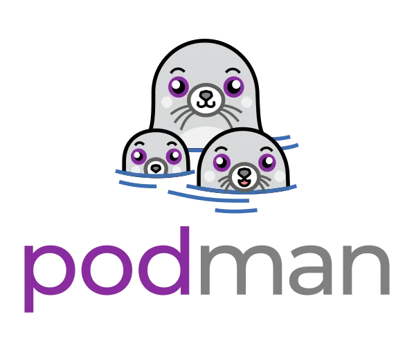
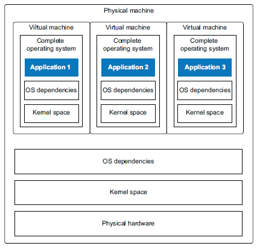
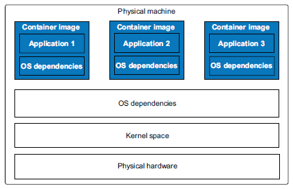
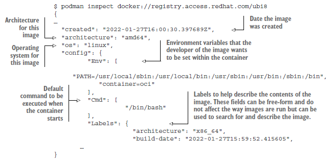
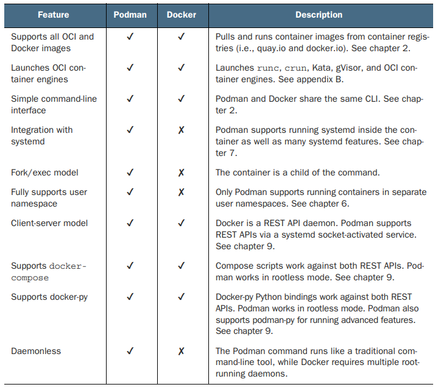
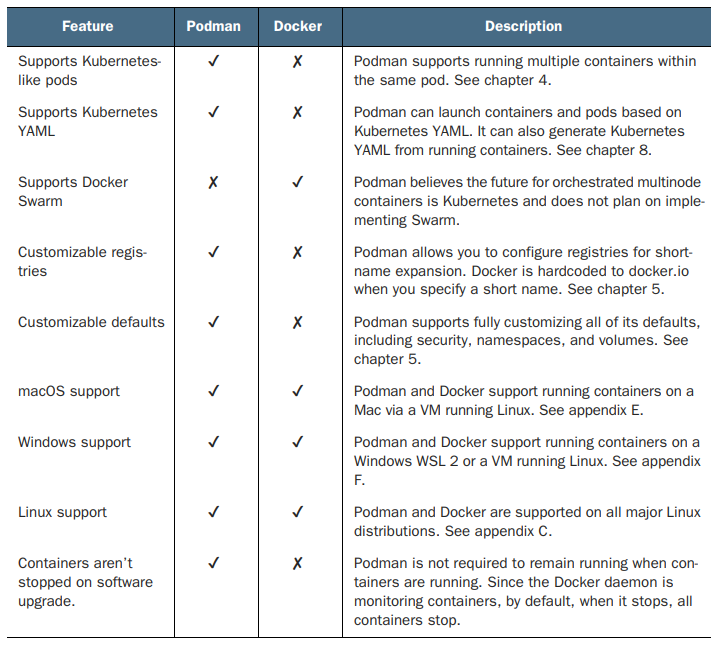
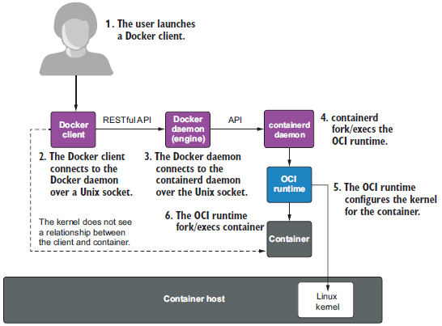
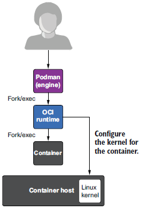

> **_NOTE:_** 
>Daniel J. Walsh, leader of the team that created Podman published a reference book in Mars 2023 named : **Podman in Action**
>It goes around bases of podman, its architecture and advanced subjects to end on its security.
>It can be a huge source of precious documentation if you want to go deeper with podman !

# 1- Presentation

[Podman](https://podman.io/) (pod manager) is an open-source, daemonless container solution for Linux.

Docker appeared in 2013 and started a transition about application deploiement from classic model to containers based applications.
When Daniel J. Walsh (creator of SELinux), working at Red Hat, started working on Docker he founds its architecture perfectible.
He believes that using privileged daemon and adding new daemons isn't a good thing. In contrast, he proposes to use low level primitives from the system to create a tool needing less privileges and able to run secured containers. From these work, his Red Hat team created Podman.

Podman can be started with our without privileges, as "rootfull" or "rootless". The project contain a CLI tool compatible with Docker, you can just replace docker command with podman through and alias : 
```alias docker=podman```

More info on [Docs](https://docs.podman.io/en/latest)

# 2 - Conteneurisation concepts


### Containers

Around podman gravitate two other tools developped by Red Hat, [Buildah](https://buildah.io/) and [Skopeo](https://github.com/containers/skopeo). Buildah is used to manipulate containers, and skopeo is used to interact with container registries.

Containers are a group of processes running in isolation on an operating system, usually Linux.

Containers ensure that one group of processes does not interact with another. It is possible to prevent a container from monopolizing all system resources, attacking other containers, stealing data or denying service.

One of the aims of containers is to deploy an application with its own libraries, without hindering another application that uses the same library, but with a different version. Containerized applications thus live as if in a VM, with the impression of occupying the entire system.

Under Linux, the following partitioning mechanisms are used to create containers:

- resource constraints ([cgroups](https://man7.org/linux/man-pages/man7/cgroups.7.html) v2) - limits on the system resources (CPU, RAM, network) used by a group of processes.

- security constraints - isolation of a process group by kernel security tools ([capabilities](https://man7.org/linux/man-pages/man7/capabilities.7.html), [SELinux](https://www.redhat.com/en/topics/linux/what-is-selinux), [seccomp](https://code.google.com/archive/p/seccompsandbox/wikis/overview.wiki), matching of host and container user and group IDs, read-only access to file systems...)
- Virtualization technologies (namespaces: [network](https://man7.org/linux/man-pages/man7/network_namespaces.7.html) and [user](https://man7.org/linux/man-pages/man7/user_namespaces.7.html) - create virtualized environments in which a set of resources (network, mount point, PID, etc.) are hidden from a group of processes: processes have the impression of being alone on the system, but without the complexity associated with creating a VM.

| 3 apps in 3 host VMs on 1 host                           | 3 apps in 3 containers on 1 host                        |
|----------------------------------------------|----------------------------------------|
|  |  |


### Container Orchestrators

Container orchestators enable you to manage containers on multiple hosts or nodes. They use a container engine to launch containers.

Kubernetes is by far the best-known and most widely used orchestrator. It was originally designed to use the docker daemon as a container engine. Today, ``CRI-O`` or ``containerd`` are the container engines used with Kubernetes.

For Podman, ```systemd``` can be thought of as a lightweight orchestrator. ```systemd``` will manage containers on a single host through service units (see the ```systemd.unit``` and ```systemd.service``` manpages). It is able to determine whether a container has finished its execution in failure (or normally) and restart the associated service unit. The restart trigger for a service unit can be set with the ```Restart=``` option. The most common is to set ``on-failure``: a container restart will be triggered by an exit code =/= 0, the reception of a signal to terminate execution, a start/stop timeout or a watchdog (manpage systemd.service)These service units can be generated by Podman itself (manpage ``podman-generate-systemd``).

Docker Swarm and Apache Mesos are other examples of container orchestrators.

### Container Engines

Container engines are used to launch containers on a single host. They are launched directly by users/administrators/developers or by an orchestrator.

Podman and Docker are the main container engines, and both comply with the Open Containers Initiative (OCI) standard.

### Open Container Initiative (OCI)

To launch a container, Podman uses a container runtime, an execution environment. The container runtime configures various parts of the Linux kernel and then launches the container. Container runtimes are not designed to be called by users, but by the container engine.

The OCI [runc](https://github.com/opencontainers/runc) is the reference container runtime, initially given by docker when it went open-source.

One of the podman team's criticisms of ``runc`` is the fact that it is written in Go. This makes the executable very heavy, and has very poor support for the fork/exec model, making it slower. This slowness is problematic on clusters with thousands of containers.

This is what prompted [Giuseppe Scrivano](https://github.com/giuseppe) to write [crun](https://github.com/containers/crun) a lightweight runtime container in C. The speed gain is around 50% compared with runc on this [benchmark](https://github.com/containers/crun#performance). crun is used by default in the latest podman versions.

### Container images

An image has three components: 

- A tree (rootfs) containing all container files
- A JSON file, the *manifest*, describing the contents of the rootfs and the parameters required to run the container.
- Another JSON file, a list of *manifest*, links several container images to support different architectures. 

We can use ``podman inspect`` to examine an image manifest : 



The JSON files and rootfs are packaged together with tar to form an image. The images are finally published on regitries.

### Registries

When podman doesn't have a local container image, it retrieves it from a registry. Roughly speaking, a registry is a file server. Many plubic registries exist, such as docker.io (docker), quay.io (redhat), AWS, GitHub... You can also deploy your own registry.


# But how does it works ?

Podman and docker are both container engines, and the differences between them lie in their architecture and functionality.

### Functionalities 

| Comparison of podman and docker functionalities |                       |
|----------------------------------------------|----------------------------------------|
|  |  |


### Architecutre

Podman works without daemon unlike docker

On the security side, not using a privileged daemon has several advantages: 
- Containers are not generated by a privileged process
- Docker daemon can be a Single-Point of Failure (SPOF)
- If the Docker daemon crashes, containers don't stop or become zombie processes.

| Docker architecture | Podman architecture |
|----------------------------------------------|----------------------------------------|
|  |  |

### So why use podman instead of Docker ?

~~beacuse~~

 Podman's most interesting feature is its ability to run rootless containers. Deploying rootless containers makes it possible to run code that may be untrusted, minimizing the risk to the host. Which is a good point for us, counting on the possible code that could execute in our containers, but it of course doesn't guarantee 100% security.

 In his book "Podman in Action", Daniel J Walsh lists other reasons for choosing Podman over Docker, mainly : 

- the fork/exec model
- The absence of daemons
- Accessible CLI
- Two REST APIs
- Integration with systemd
- The Kubernetes pod concept

If you'd like to know more about these reasons, feel free to read the book where everything is detailed.


### How to use podman 

You will mainly use the python script made for using de container but it will always be good to have so bases if you need to debug something at anytime.

You can find all commands [here](https://docs.podman.io/en/stable/Commands.html)


Here are some usefull command if you want to create issues on github in order to give us details !

``podman inspect `` -> give details about de container, image, pod, network or volume given as argument. You can get a JSON file by adding ``--format JSON``

``podman logs`` -> give logs about a container, you can get logs from a date adding ``--since "DATE"``

``podman events`` -> return what happened on the host based on categories : container, pod, image, system, volume